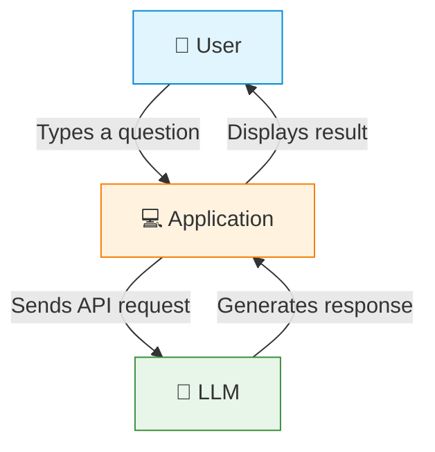

# Basic LLM Interaction Flow

## Description

This diagram shows the simplest form of LLM interaction:

1. **User** types a natural language question
2. **Application** sends the question to the LLM via API
3. **LLM** processes the input and generates a response
4. **Application** displays the response to the user

Without a framework like LangChain, the application must handle all the details: formatting the request, managing the API connection, parsing the response, and handling errors.
