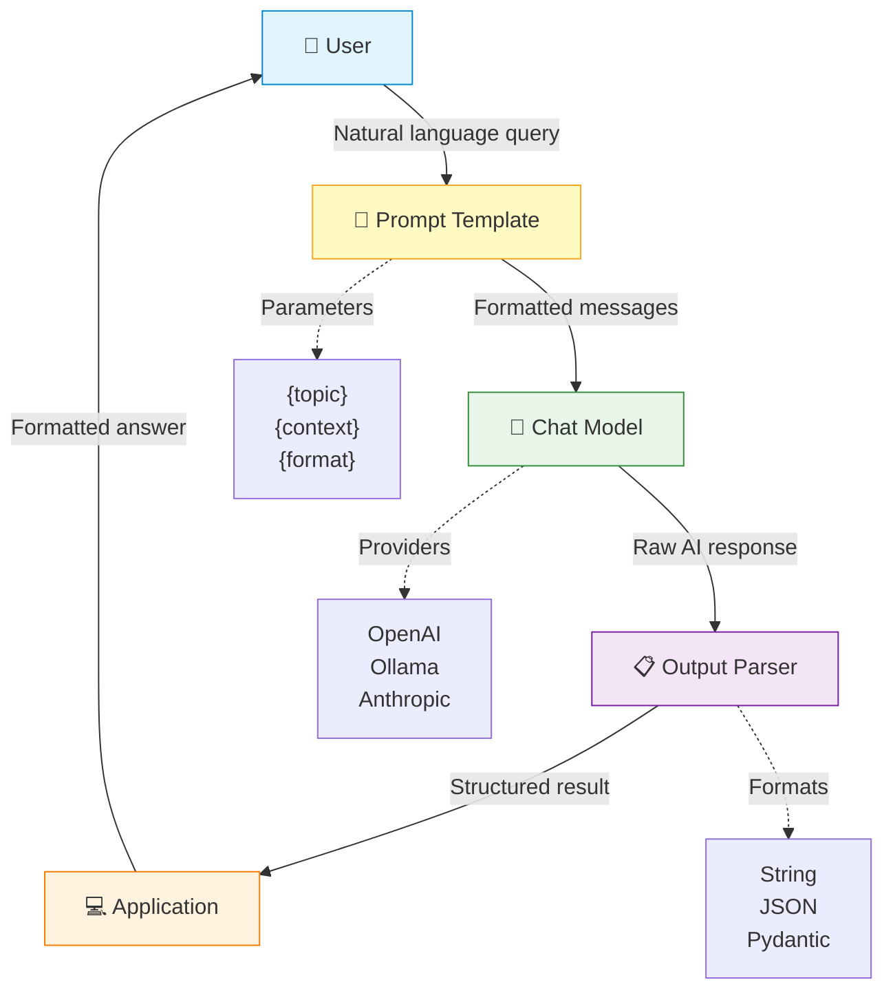

# LLM Application Flow with LangChain

## Description

This diagram shows a structured LLM application built with LangChain:

1. **User** submits a natural language query
2. **Prompt Template** formats the query with variables and system instructions
3. **Chat Model** processes the formatted prompt (supports multiple providers)
4. **Output Parser** converts the raw AI response into structured data
5. **Application** presents the formatted answer to the user

Each component is modular and can be swapped independently — change the model provider, adjust the prompt template, or switch output formats without rewriting the entire pipeline.
