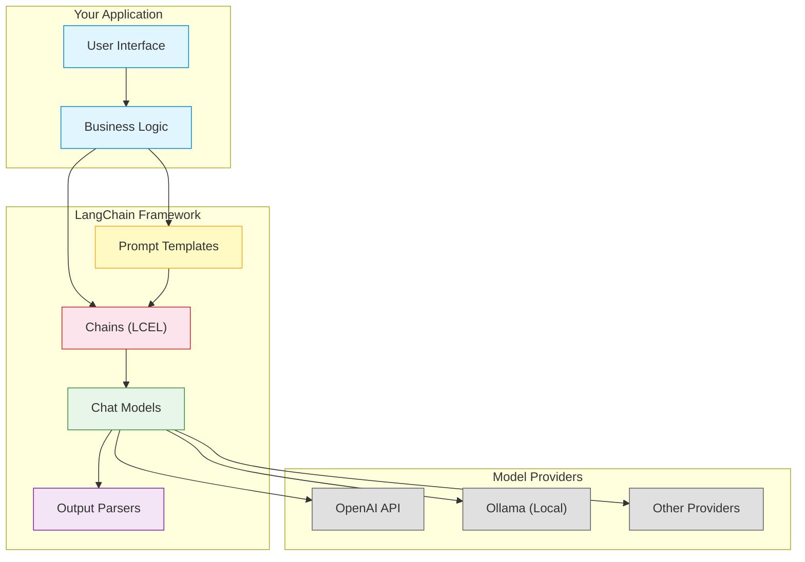

# LangChain Architecture Overview

## Description

LangChain sits between your application and model providers:

### Layer 1: Your Application
- **User Interface** — How users interact with your app
- **Business Logic** — Your data science workflows and decision-making

### Layer 2: LangChain Framework
- **Prompt Templates** — Reusable, parameterized instructions for LLMs
- **Chat Models** — Unified interface to different LLM providers
- **Output Parsers** — Convert LLM text output to structured data
- **Chains (LCEL)** — Connect components into pipelines using the `|` operator

### Layer 3: Model Providers
- **OpenAI API** — Cloud-based models (GPT-4o, GPT-4o-mini)
- **Ollama (Local)** — Run models on your own hardware
- **Other Providers** — Anthropic, Google, open-source models

### Key Insight
LangChain lets you swap any layer independently. Switch from OpenAI to Ollama by changing one line. Modify your prompt template without touching model code. Add output parsing without rewriting your prompts.
