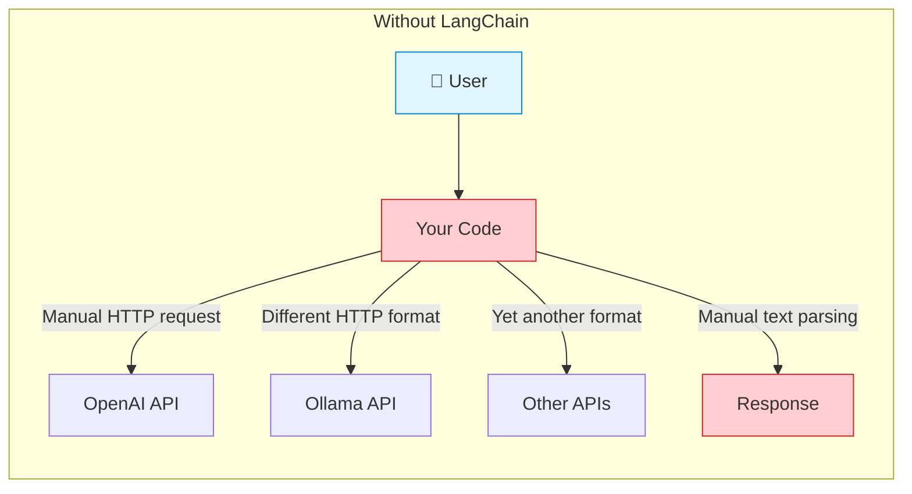
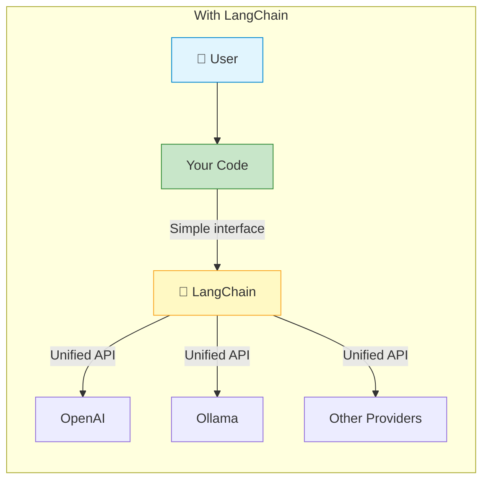

# Direct API Calls vs LangChain

## Without LangChain (Direct API Calls)



**Problems:**
- Each provider has a different API format
- You must handle authentication, retries, and error handling for each
- Parsing responses requires custom code for each provider
- No built-in support for prompts, memory, or tool integration

---

## With LangChain



**Benefits:**
- Same code works with any provider
- Built-in authentication, retries, and error handling
- Consistent interface for prompts, memory, and tools
- Easy to switch providers with minimal code changes

---

## Side-by-Side Code Comparison

### Direct API Call (Manual)
```python
import openai

client = openai.OpenAI(api_key="your-key")
response = client.chat.completions.create(
    model="gpt-4o-mini",
    messages=[
        {"role": "system", "content": "You are a data scientist."},
        {"role": "user", "content": "Explain feature engineering."}
    ]
)
print(response.choices[0].message.content)
```

### LangChain Approach
```python
from langchain_openai import ChatOpenAI
from langchain_core.prompts import ChatPromptTemplate
from langchain_core.output_parsers import StrOutputParser

model = ChatOpenAI(model="gpt-4o-mini")
prompt = ChatPromptTemplate.from_messages([
    ("system", "You are a data scientist."),
    ("human", "{question}")
])
chain = prompt | model | StrOutputParser()
print(chain.invoke({"question": "Explain feature engineering."}))
```

**Same result, but LangChain is modular, reusable, and provider-agnostic!**
