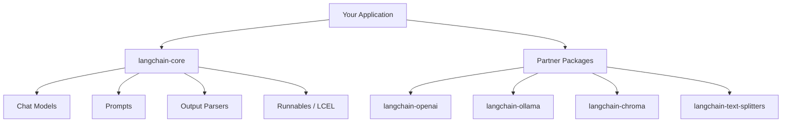

# 01 — Introduction to LangChain for Data Science

> 📓 **Hands-on Notebook:** [01 — LangChain Introduction](../notebooks/01_LangChain_Introduction.ipynb)

**Level:** Beginner | **Reading time:** 20-30 minutes

## Learning Objectives

- Understand what LLMs are and how they work at a high level
- Understand what an LLM application is
- Learn why LangChain exists and what problem it solves
- Understand the basic LangChain architecture
- Know the difference between API-based and local LLM usage

## Prerequisites

- Basic Python knowledge
- Familiarity with APIs (helpful but not required)
- No prior LLM experience needed

---

## 1. What is an LLM?

A **Large Language Model (LLM)** is a neural network trained on vast amounts of text data. It learns patterns in language and can generate human-like text in response to prompts.

**Key characteristics:**
- Takes text input, produces text output
- Trained on billions of words from books, websites, and other text
- Can perform many tasks without task-specific training
- Probabilistic: same input can produce different outputs

**What LLMs can do:**
- Answer questions
- Summarize text
- Translate between languages
- Write code
- Explain concepts
- Generate content

**What LLMs cannot do (without help):**
- Access real-time information
- Perform precise calculations
- Interact with databases
- Browse the internet
- Remember past conversations (without context management)

## 2. What is an LLM Application?

An **LLM application** is software that uses an LLM as a core component to perform a specific task. It wraps the LLM with additional logic like prompts, tools, and data retrieval.

```
User → Application → LLM → Response
```

**Simple example:** A Data Science tutor that answers questions about machine learning.

**Complex example:** A RAG system that searches course notes, retrieves relevant documents, and generates grounded answers.

### Why build LLM applications?

LLMs are powerful but generic. An LLM application tailors the LLM to a specific domain, adds guardrails, and integrates with external systems.

## 3. Why LangChain?

Before LangChain, every LLM application needed custom integration code for:

- Connecting to different LLM providers (OpenAI, Ollama, etc.)
- Managing prompts and templates
- Chaining operations together
- Retrieving and storing documents
- Calling external tools

**LangChain provides:**
- A unified interface for multiple LLM providers
- Prompt template management
- Chain composition with the LCEL pipe operator
- Integration with vector stores, tools, and agents
- A growing ecosystem of partner libraries

## 4. LangChain Architecture

LangChain is organized into several layers:



| Package | Purpose |
|---------|---------|
| `langchain-core` | Base abstractions, LCEL, prompts, messages |
| `langchain-openai` | OpenAI integration (ChatOpenAI, OpenAIEmbeddings) |
| `langchain-ollama` | Ollama integration (ChatOllama, OllamaEmbeddings) |
| `langchain-chroma` | ChromaDB vector store integration |
| `langchain-text-splitters` | Text splitting for document processing |

## 5. Important Terminology

| Term | Definition |
|------|-----------|
| **LLM** | Large Language Model — the neural network that generates text |
| **Chat Model** | An LLM that works with structured messages (not just raw text) |
| **Prompt** | The text instruction sent to the LLM |
| **Chain** | A sequence of operations connected together |
| **Agent** | An LLM that decides which tools to use |
| **Tool** | An external function the LLM can call |
| **Retrieval** | Finding relevant documents from a knowledge base |
| **Embedding** | A numerical vector representation of text |
| **Vector Store** | A database for storing and searching embeddings |

## 6. Data Science Applications

LangChain is particularly useful for Data Science because it enables:

- **Data Science tutors** that explain concepts and generate code
- **RAG systems** over course notes and textbooks
- **SQL agents** that translate natural language to queries
- **Dataset analyzers** that process CSV data with LLM reasoning
- **Quiz generators** that create questions from course material
- **Code assistants** that write Python for data analysis

## 7. API vs Local Models

| Aspect | Cloud API (OpenAI) | Local (Ollama) |
|--------|-------------------|----------------|
| **Cost** | Pay per token | Free (hardware cost) |
| **Internet** | Required | Not required |
| **Privacy** | Data leaves your machine | Data stays local |
| **Quality** | Generally higher | Model-dependent |
| **Speed** | Network + inference | Hardware-dependent |
| **Setup** | API key | Install Ollama |

**Recommendation for students:** Start with the API for learning, then explore local models for privacy-sensitive applications.

## 8. Common Mistakes

- **Treating LLMs as databases:** LLMs generate probable text, not facts
- **Ignoring prompt quality:** Small prompt changes can dramatically affect output
- **Not setting temperature:** Default temperature may not suit your use case
- **Hardcoding API keys:** Always use environment variables
- **Skipping error handling:** LLM calls can fail for many reasons

## 9. Key Takeaways

- LLMs generate text based on patterns learned from training data
- LLM applications combine LLMs with prompts, tools, and data
- LangChain provides a unified framework for building LLM applications
- The architecture has layers: core abstractions, partner packages, your application
- Both cloud APIs and local models are viable options

## 10. Before You Run the Notebook

1. Install dependencies: `pip install -r requirements.txt`
2. Copy `.env.example` to `.env`
3. Add your API key to `.env` (or install Ollama for local mode)
4. Launch Jupyter: `jupyter notebook`
5. Open `notebooks/01_LangChain_Introduction.ipynb`

## 11. Further Reading

**Official Documentation:**
- [LangChain Python Documentation](https://docs.langchain.com/)
- [LangChain GitHub](https://github.com/langchain-ai/langchain)

**Additional Reading:**
- [What is LangChain? (LangChain Blog)](https://blog.langchain.dev/)

---

**Next:** [02 — Models, Prompts and Messages](02_Models_Prompts_and_Messages.md)

**Back to:** [Reading Index](README.md) | [Repository README](../README.md)
