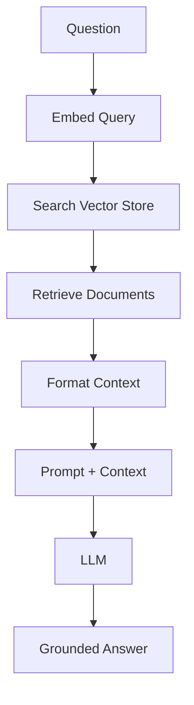

# 05 — Retrieval-Augmented Generation (RAG)

> 📓 **Hands-on Notebook:** [05 — RAG Applications](../notebooks/05_RAG_Applications.ipynb)

**Level:** Advanced | **Reading time:** 35-45 minutes

## Learning Objectives

- Understand what RAG is and why it exists
- Learn the complete RAG pipeline
- Understand document loading, chunking, embedding, and retrieval
- Know the difference between RAG and fine-tuning
- Understand hallucination and how RAG helps

---

## 1. The Problem RAG Solves

LLMs have limitations:
- Knowledge is frozen at training time
- No access to private documents
- Can hallucinate (generate plausible but false information)
- Cannot cite sources

**RAG** (Retrieval-Augmented Generation) lets an LLM search a knowledge base and use retrieved information when generating answers.

## 2. What is RAG?

**Simple explanation:** RAG allows an LLM to look up relevant information before answering a question, like a student consulting textbooks during an open-book exam.

**Technical definition:** RAG combines information retrieval with text generation by retrieving relevant documents from an external knowledge base and incorporating them into the LLM's context.

## 3. RAG Pipeline

| Step | What Happens | Why |
|------|-------------|-----|
| **Load** | Read documents from files | Get raw content |
| **Split** | Break into chunks | Fit within context limits |
| **Embed** | Convert chunks to vectors | Enable semantic search |
| **Store** | Save in vector store | Enable fast retrieval |
| **Retrieve** | Find relevant chunks | Get context for the question |
| **Generate** | LLM answers with context | Produce grounded answer |

## 4. Chunking

**Why chunk?** LLMs have limited context windows. Large documents must be split into manageable pieces.

**Chunk size matters:**
- Too small: Loses context, fragmented information
- Too large: May exceed context limits, includes irrelevant information
- Sweet spot: Usually 200-1000 tokens depending on use case

**Chunk overlap:** Overlapping chunks ensure information at boundaries isn't lost.

## 5. RAG vs Fine-Tuning

| Aspect | RAG | Fine-Tuning |
|--------|-----|-------------|
| **Data requirement** | Documents | Training examples |
| **Cost** | Low (just store docs) | High (GPU training) |
| **Update** | Add/remove documents | Retrain model |
| **Transparency** | Can cite sources | Black box |
| **Best for** | Knowledge retrieval | Behavior/style changes |

**Use RAG when:** You need the LLM to reference specific information.
**Use fine-tuning when:** You need to change how the model behaves.

## 6. Hallucination

**Hallucination** is when an LLM generates confident-sounding but incorrect information.

**How RAG helps:**
- Provides factual context the LLM can reference
- Enables source citation
- Grounds answers in actual documents

**RAG does NOT eliminate hallucination** — the LLM can still generate unsupported claims even with retrieved context.

## 7. Retrieval Quality

| Metric | What It Measures |
|--------|-----------------|
| **Recall** | Did we find all relevant documents? |
| **Precision** | Are the retrieved documents actually relevant? |
| **Relevance** | Does the retrieved content match the question? |

## 8. Context Management

- **Too little context:** Answer lacks detail
- **Too much context:** LLM gets confused, costs more tokens
- **Duplicate chunks:** Wastes context window
- **Irrelevant chunks:** Dilutes the answer

## 9. Data Science Applications

- **Course Q&A:** Search lecture notes for answers
- **Textbook assistant:** Find relevant sections for questions
- **Research paper search:** Find papers matching a query
- **Documentation search:** Find relevant API docs

## 10. Common Mistakes

- **Not chunking:** Passing entire documents exceeds context limits
- **Wrong chunk size:** Too small loses context, too large adds noise
- **Ignoring metadata:** Metadata filtering improves retrieval precision
- **Blind trust:** RAG retrieved content is not guaranteed to be accurate

## 11. Key Takeaways

- RAG combines retrieval with generation for grounded answers
- The pipeline: Load → Split → Embed → Store → Retrieve → Generate
- Chunk size significantly affects retrieval quality
- RAG is generally preferred over fine-tuning for knowledge retrieval
- RAG reduces but does not eliminate hallucination

## 12. Further Reading

**Official Documentation:**
- [RAG (LangChain)](https://python.langchain.com/docs/concepts/rag/)
- [How to use RAG](https://python.langchain.com/docs/tutorials/rag/)

**Research:**
- [Retrieval-Augmented Generation for Knowledge-Intensive NLP Tasks (Lewis et al., 2020)](https://arxiv.org/abs/2005.11401)

---

**Previous:** [04 — Embeddings and Vector Stores](04_Embeddings_and_Vector_Stores.md)
**Next:** [06 — Tools and Agents](06_Tools_and_Agents.md)

**Back to:** [Reading Index](README.md)
