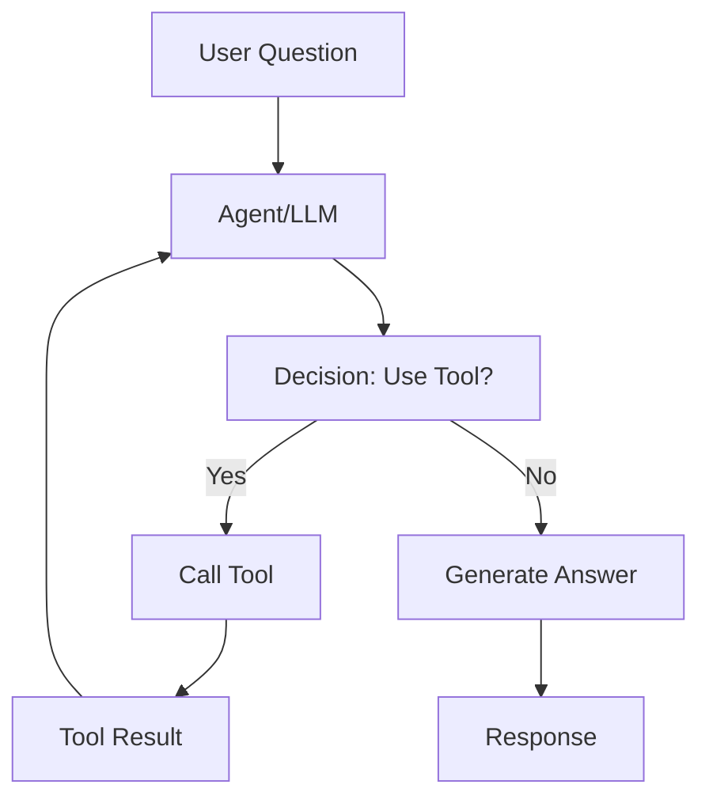

# 06 — Tools, Tool Calling and Agents

> 📓 **Hands-on Notebook:** [06 — Tools and Agents](../notebooks/06_Tools_and_Agents.ipynb)

**Level:** Advanced | **Reading time:** 30-40 minutes

## Learning Objectives

- Understand what tools are and why they're needed
- Learn how tool calling works
- Understand the agent loop (ReAct pattern)
- Know when to use agents vs chains
- Understand agent safety considerations

---

## 1. What is a Tool?

A **tool** is an external function that an LLM can call to perform actions beyond text generation.

**Why tools matter:**
- LLMs cannot do math precisely
- LLMs cannot access real-time data
- LLMs cannot interact with databases
- LLMs cannot execute code

Tools extend the LLM's capabilities.

## 2. How Tool Calling Works



1. The LLM receives the question
2. It decides if a tool is needed
3. If yes, it generates a tool call with arguments
4. The tool executes and returns a result
5. The LLM uses the result to generate the final answer

## 3. Tool Schemas

Every tool has a **schema** that tells the LLM:
- **Name:** What the tool is called
- **Description:** What the tool does
- **Parameters:** What inputs the tool expects (with types)

The LLM reads this schema to decide which tool to use and how to call it.

## 4. The Agent Loop

The **agent loop** is the cycle of: Think → Act → Observe → Think again

This is sometimes called the **ReAct** pattern (Reasoning + Acting).

```
Thought: I need to calculate the mean
Action: calculate_mean(numbers)
Observation: {"mean": 25.0}
Thought: Now I can answer the question
Answer: The mean is 25.0
```

## 5. Chain vs Agent

| Aspect | Chain | Agent |
|--------|-------|-------|
| **Flow** | Fixed, predetermined | Dynamic, LLM-decided |
| **Transparency** | High (you see the pipeline) | Low (black box decisions) |
| **Reliability** | Very reliable | Can make mistakes |
| **Speed** | Faster | Slower (multiple LLM calls) |
| **Use case** | Known workflow | Open-ended tasks |

**Rule of thumb:** If you know the exact steps, use a chain. If the LLM needs to decide, use an agent.

## 6. Agent Safety

Agents are powerful but risky:
- **Tool permissions:** Limit what tools can do
- **Input validation:** Validate tool inputs
- **Rate limiting:** Prevent excessive tool calls
- **Human approval:** For destructive actions
- **Logging:** Record all tool calls

## 7. Data Science Applications

| Tool | Purpose |
|------|---------|
| `calculate_mean` | Compute statistics |
| `dataset_summary` | Profile CSV data |
| `query_database` | SQL queries |
| `generate_code` | Write Python code |

## 8. Key Takeaways

- Tools extend LLM capabilities beyond text generation
- Tool schemas tell the LLM what tools are available
- The agent loop: Think → Act → Observe → Repeat
- Use chains for fixed workflows, agents for dynamic tasks
- Always validate tool inputs and limit tool permissions

## 9. Further Reading

**Official Documentation:**
- [Tools (LangChain)](https://python.langchain.com/docs/concepts/tools/)
- [Agents (LangChain)](https://python.langchain.com/docs/concepts/agents/)

---

**Previous:** [05 — RAG Applications](05_RAG_Applications.md)
**Next:** [07 — Advanced LangChain Project](07_Advanced_LangChain_Project.md)

**Back to:** [Reading Index](README.md)
