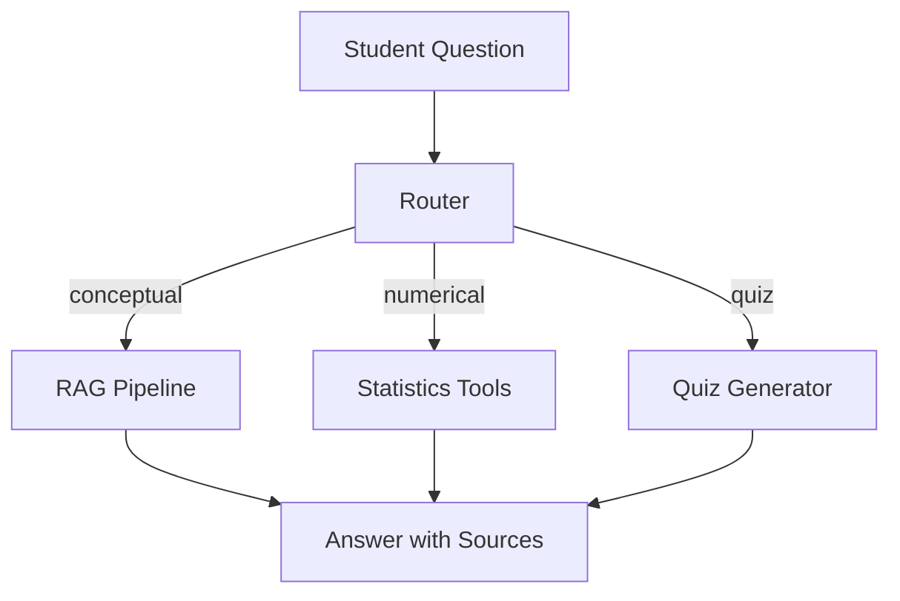

# 07 — Capstone Project: Data Science AI Tutor

> 📓 **Hands-on Notebook:** [07 — Advanced LangChain Project](../notebooks/07_Advanced_LangChain_Project.ipynb)

**Level:** Advanced | **Reading time:** 20-25 minutes

## Learning Objectives

- Understand how to combine multiple LangChain components
- Learn the architecture of a complete LLM application
- Understand the factory pattern for provider-agnostic code
- Know how RAG, tools, and structured output work together

---

## 1. What This Project Builds

A **Data Science AI Tutor** that combines:

## 2. Architecture Principles

| Principle | Implementation |
|-----------|---------------|
| **Separation of concerns** | Each component has one job |
| **Provider-agnostic** | Config toggle switches between API and Ollama |
| **Error handling** | Graceful fallbacks at every layer |
| **Modularity** | Components can be tested independently |

## 3. Integration Patterns

The capstone integrates:
- **RAG** for knowledge retrieval
- **Tools** for numerical calculations
- **Structured output** for quiz generation
- **Prompts** for different task types
- **Configuration** for API/Ollama switching

## 4. Key Takeaways

- A complete LLM application combines multiple components
- Architecture matters — separate concerns, handle errors, test independently
- Provider-agnostic code lets you switch between API and local models
- The factory pattern creates clean, testable code

## 5. Before You Run the Notebook

1. Complete Readings 01-06 first
2. Have your API key ready (or Ollama running)
3. The notebook builds the application step-by-step

## 6. Further Reading

**Official Documentation:**
- [LangChain Tutorials](https://python.langchain.com/docs/tutorials/)

---

**Previous:** [06 — Tools and Agents](06_Tools_and_Agents.md)
**Next:** [08 — Advanced RAG](08_Advanced_RAG.md)

**Back to:** [Reading Index](README.md)
