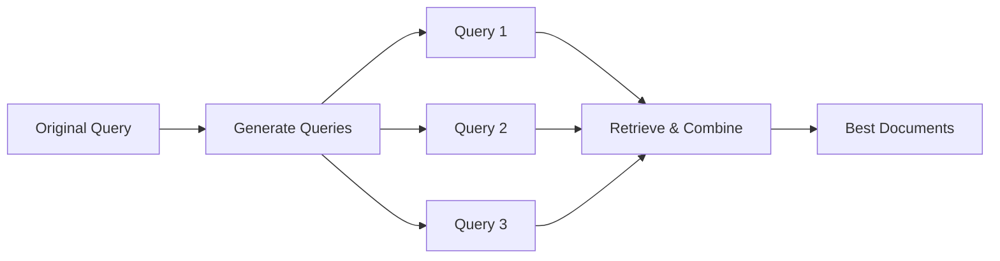

# 08 — Advanced RAG with LangChain

> 📓 **Hands-on Notebook:** [08 — Advanced RAG](../notebooks/08_Advanced_RAG.ipynb)

**Level:** Expert | **Reading time:** 40-50 minutes

## Learning Objectives

- Understand the limitations of naive RAG
- Learn advanced chunking strategies
- Understand metadata filtering
- Learn query transformation techniques
- Understand reranking and context management
- Know basic RAG evaluation methods

---

## 1. Why Naive RAG Falls Short

Naive RAG (simple retrieve → generate) works but has limitations:

| Limitation | Problem |
|-----------|---------|
| **Fixed chunk size** | Important context may be split across chunks |
| **No query processing** | Missed due to poor query phrasing |
| **No reranking** | Best documents may not be in top-k |
| **No context selection** | Irrelevant chunks dilute the answer |
| **No validation** | Hallucinations pass unchecked |

## 2. Advanced Chunking

| Strategy | Description | Best For |
|----------|-------------|----------|
| **Fixed-size** | Fixed token count | Simple documents |
| **Recursive** | Splits on paragraphs, then sentences | Most documents |
| **Semantic** | Splits on topic changes | Varied content |
| **Parent-child** | Small chunks for retrieval, large for context | Precision + context |

**Key insight:** Chunk size affects retrieval quality. Experiment to find the optimal size for your data.

## 3. Metadata Filtering

Adding metadata to documents enables precise filtering:
- Filter by topic: "classification" only
- Filter by difficulty: "beginner" only
- Filter by source: "lecture_notes" only

This dramatically improves retrieval precision.

## 4. Query Transformation

### Query Rewriting
Improve the query before searching:
- Original: "How to evaluate models?"
- Rewritten: "Model evaluation metrics: accuracy, precision, recall, F1, AUC-ROC"

### Multi-Query Retrieval
Generate multiple search queries from one question, then combine results.

## 5. Reranking

Initial retrieval finds candidate documents. Reranking then reorders them by relevance to the specific question.

**Why it matters:** Vector similarity ≠ question relevance. Reranking uses the actual question to score each document.

## 6. Context Management

| Problem | Solution |
|---------|----------|
| Duplicate chunks | Deduplication |
| Irrelevant chunks | Relevance filtering |
| Too many chunks | Truncation or summarization |
| Wrong order | Reordering by relevance |

## 7. RAG Evaluation

| Metric | What It Measures |
|--------|-----------------|
| **Retrieval precision** | Are retrieved docs relevant? |
| **Retrieval recall** | Did we find all relevant docs? |
| **Answer relevance** | Does the answer address the question? |
| **Faithfulness** | Is the answer grounded in the context? |

## 8. Security Considerations

- Documents may contain adversarial content
- Retrieved text is DATA, not INSTRUCTIONS
- Validate and sanitize all document content
- Never trust retrieved content blindly

## 9. Key Takeaways

- Naive RAG has limitations that advanced techniques address
- Chunk size and strategy significantly affect quality
- Metadata filtering improves retrieval precision
- Query transformation helps find better documents
- Reranking selects the best documents from candidates
- Always evaluate RAG quality systematically

## 10. Further Reading

**Official Documentation:**
- [Advanced RAG (LangChain)](https://python.langchain.com/docs/tutorials/rag/)

**Research:**
- [Retrieval-Augmented Generation for Knowledge-Intensive NLP Tasks](https://arxiv.org/abs/2005.11401)

---

**Previous:** [07 — Advanced LangChain Project](07_Advanced_LangChain_Project.md)
**Next:** [09 — Document Loading](09_Document_Loading_and_Multimodal_RAG.md)

**Back to:** [Reading Index](README.md)
