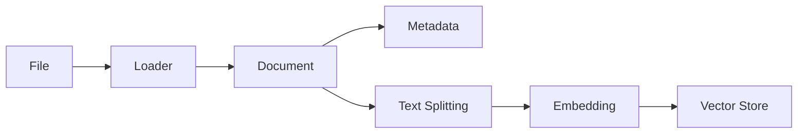

# 09 — Document Processing and Multimodal RAG

> 📓 **Hands-on Notebook:** [09 — Document Loading and Multimodal RAG](../notebooks/09_Document_Loading_and_Multimodal_RAG.ipynb)

**Level:** Expert | **Reading time:** 30-40 minutes

## Learning Objectives

- Understand different document formats and loaders
- Learn how metadata is preserved during loading
- Understand the difference between document retrieval and structured analysis
- Learn about multimodal RAG concepts
- Understand security risks with document processing

---

## 1. Real-World Knowledge Bases

Real knowledge bases contain multiple formats:
- **TXT/Markdown:** Simple text, notes
- **PDF:** Academic papers, textbooks
- **CSV:** Datasets, tabular data
- **JSON:** Structured records
- **HTML:** Web content

Each format requires a different loader.

## 2. Document Loading Pipeline

## 3. Document vs Structured Data

| Aspect | Document Retrieval | Structured Analysis |
|--------|-------------------|-------------------|
| **Data type** | Unstructured text | Tables, numbers |
| **Tool** | RAG, embeddings | Pandas, SQL |
| **Use case** | "Explain X" | "What is the average of Y?" |
| **Output** | Text answer | Calculated result |

**Important:** Not everything needs an LLM. Use Pandas for numerical analysis, LLMs for text understanding.

## 4. Multimodal RAG

**Multimodal RAG** handles text, images, tables, and charts — not just plain text.

| Modality | Processing |
|----------|-----------|
| Text | Standard RAG pipeline |
| Images | Vision-language models |
| Tables | Table-aware extraction |
| Charts | Image understanding |

## 5. Security Considerations

- **Malicious PDFs:** Can contain hidden content
- **Prompt injection via documents:** Injected instructions in document text
- **Metadata poisoning:** False metadata affects retrieval
- **Sensitive information:** PII in documents

## 6. Key Takeaways

- Different document formats need different loaders
- Metadata is preserved and useful for filtering
- Use RAG for text understanding, Pandas for numerical analysis
- Multimodal RAG handles text, images, tables, and charts
- Always sanitize documents before ingestion

## 7. Further Reading

**Official Documentation:**
- [Document Loaders (LangChain)](https://python.langchain.com/docs/concepts/document_loaders/)

---

**Previous:** [08 — Advanced RAG](08_Advanced_RAG.md)
**Next:** [10 — SQL and Databases](10_SQL_and_Database_AI.md)

**Back to:** [Reading Index](README.md)
