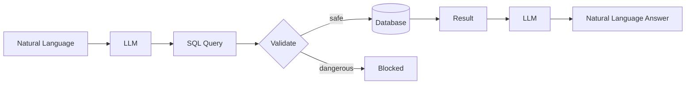

# 10 — SQL, Databases and LangChain

> 📓 **Hands-on Notebook:** [10 — SQL and Database AI](../notebooks/10_SQL_and_Database_AI.ipynb)

**Level:** Expert | **Reading time:** 30-40 minutes

## Learning Objectives

- Understand how LLMs can interact with databases
- Learn natural language to SQL translation
- Understand SQL safety and validation
- Know the difference between read-only and write access
- Understand the risks of LLM-generated SQL

---

## 1. The Problem

Data analysts spend time writing SQL queries. LLMs can translate natural language to SQL, making databases accessible to non-technical users.

```
User: "What were total sales by month?"
  → LLM generates: SELECT month, SUM(amount) FROM sales GROUP BY month
  → Database returns results
  → LLM formats answer
```

## 2. Architecture



## 3. SQL Safety

**Critical:** LLM-generated SQL can be dangerous.

| Risk | Example | Mitigation |
|------|---------|------------|
| **DROP TABLE** | `DROP TABLE students;` | Block destructive commands |
| **DELETE** | `DELETE FROM sales;` | Read-only access only |
| **INSERT** | `INSERT INTO users...` | Allow SELECT only |
| **UNION attacks** | `UNION SELECT password...` | Validate query structure |

**Always show the generated SQL before execution.**

## 4. Natural Language to SQL

The LLM translates:
- "Show me students with high GPA" → `SELECT * FROM students WHERE gpa > 3.5`
- "Total sales by product" → `SELECT product, SUM(amount) FROM sales GROUP BY product`

**Challenges:**
- Ambiguous queries ("high" GPA? What threshold?)
- Complex joins
- Aggregation functions
- Table/column name matching

## 5. Read-Only Architecture

The safest approach:
1. Generate SQL with LLM
2. Validate the SQL (SELECT only, no dangerous commands)
3. Execute on a read-only database connection
4. Return results to LLM for formatting

## 6. Data Science Applications

- **Natural language data analyst:** Ask questions about datasets
- **Report generator:** Generate SQL for business reports
- **Data exploration:** Quick database queries without SQL knowledge
- **Dashboard assistant:** Natural language queries for dashboards

## 7. Key Takeaways

- LLMs can translate natural language to SQL
- ALWAYS validate generated SQL before execution
- Use read-only database access
- Show generated SQL to users for verification
- LLM-generated SQL is not perfect — humans should review

## 8. Further Reading

**Official Documentation:**
- [SQL Chains (LangChain)](https://python.langchain.com/docs/tutorials/sql/)

---

**Previous:** [09 — Document Loading](09_Document_Loading_and_Multimodal_RAG.md)
**Next:** [11 — Data Science Agents](11_Data_Science_Agents.md)

**Back to:** [Reading Index](README.md)
