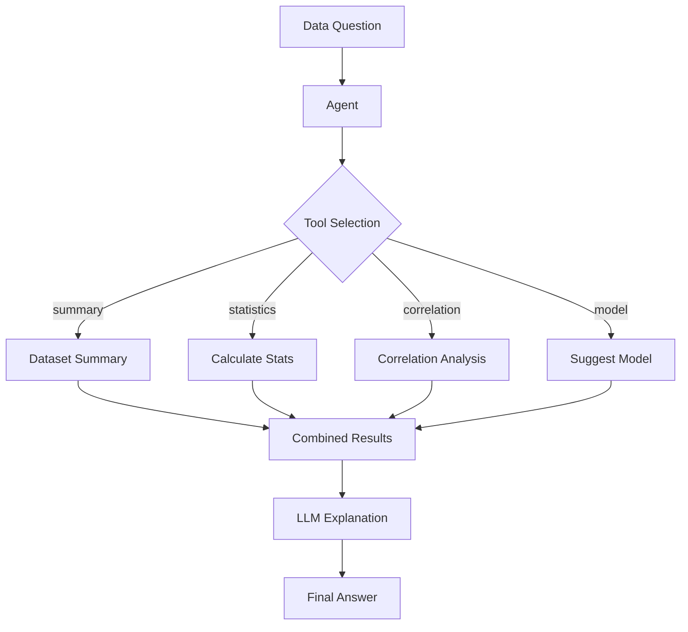

# 11 — Building Data Science Agents with LangChain

> 📓 **Hands-on Notebook:** [11 — Data Science Agents](../notebooks/11_Data_Science_Agents.ipynb)

**Level:** Expert | **Reading time:** 30-40 minutes

## Learning Objectives

- Understand the difference between traditional DS workflows and agent-based workflows
- Learn how agents combine tools, RAG, and structured output
- Understand agent design for Data Science tasks
- Know when to use agents vs fixed pipelines

---

## 1. Traditional vs Agent-Based Workflows

| Aspect | Traditional | Agent-Based |
|--------|------------|-------------|
| **Flow** | Human decides each step | Agent decides steps |
| **Speed** | Slower (human bottleneck) | Faster (automated) |
| **Flexibility** | High (human adapts) | Medium (agent follows patterns) |
| **Reliability** | High (human judgment) | Variable (depends on agent quality) |

## 2. DS Agent Architecture

## 3. Agent Design Principles

| Principle | Description |
|-----------|-------------|
| **Single responsibility** | Each tool does one thing well |
| **Safe by default** | Tools validate inputs, limit outputs |
| **Observable** | Log all tool calls and decisions |
| **Graceful failure** | Handle errors without crashing |

## 4. Key Takeaways

- Agents combine multiple tools for complex Data Science tasks
- Design tools with single responsibility and safety
- Use agents for flexible workflows, pipelines for fixed ones
- Always log agent decisions for debugging

## 5. Further Reading

**Official Documentation:**
- [Agents (LangChain)](https://python.langchain.com/docs/concepts/agents/)

---

**Previous:** [10 — SQL and Databases](10_SQL_and_Database_AI.md)
**Next:** [12 — LangGraph](12_LangGraph_for_Data_Science.md)

**Back to:** [Reading Index](README.md)
