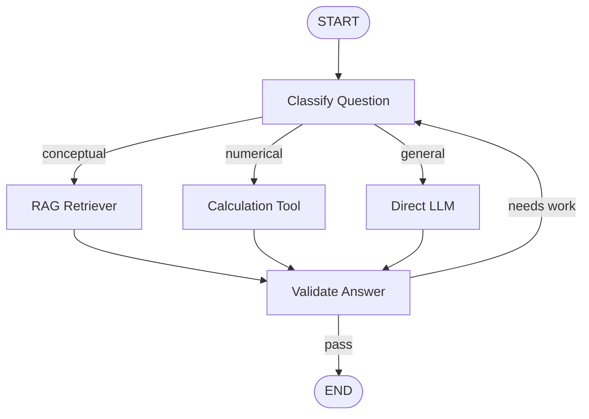

# 12 — LangGraph for Stateful Data Science AI Applications

> 📓 **Hands-on Notebook:** [12 — LangGraph for Data Science](../notebooks/12_LangGraph_for_Data_Science.ipynb)

**Level:** Expert | **Reading time:** 35-45 minutes

## Learning Objectives

- Understand why LangGraph exists
- Learn the core concepts: State, Nodes, Edges
- Understand conditional routing
- Know when to use LangGraph vs LangChain chains
- Understand human-in-the-loop patterns

---

## 1. Why LangGraph?

Simple chains are linear. Real applications need:
- **Conditional routing:** Different paths for different inputs
- **Loops:** Retry or refine outputs
- **State:** Remember information across steps
- **Validation:** Check outputs before proceeding

LangGraph models workflows as **graphs** of nodes and edges.

## 2. Core Concepts

| Concept | Description |
|---------|-------------|
| **State** | A dictionary that flows through the graph |
| **Node** | A function that reads state, does work, returns updates |
| **Edge** | A connection between nodes |
| **Conditional edge** | A connection that depends on state |
| **START/END** | Entry and exit points |

## 3. Graph Architecture

## 4. Conditional Routing

The key feature of LangGraph. Based on the current state, the graph decides which node to visit next.

**Example:** Route conceptual questions to RAG, numerical questions to tools, general questions to the LLM.

## 5. Loops

LangGraph supports controlled loops:
- Generate → Validate → If bad, regenerate
- Classify → Process → If unclear, reclassify

**Important:** Always have a maximum iteration count to prevent infinite loops.

## 6. Human-in-the-Loop

LangGraph can pause and wait for human approval:
- Sensitive operations (deploy, delete)
- Uncertain decisions
- Quality checks

## 7. LangChain vs LangGraph

| Aspect | LangChain | LangGraph |
|--------|-----------|-----------|
| **Purpose** | Component composition | Workflow orchestration |
| **Flow** | Fixed or agent-decided | Explicitly defined |
| **State** | Implicit | Explicit (TypedDict) |
| **Loops** | Not native | First-class support |
| **Transparency** | High | Very high |

## 8. Key Takeaways

- LangGraph models workflows as graphs with nodes and edges
- State carries information through the graph
- Conditional routing enables dynamic decision-making
- Loops enable refinement and retry patterns
- Use LangGraph for complex, stateful workflows

## 9. Further Reading

**Official Documentation:**
- [LangGraph](https://langchain-ai.github.io/langgraph/)
- [LangGraph Concepts](https://langchain-ai.github.io/langgraph/concepts/)

---

**Previous:** [11 — Data Science Agents](11_Data_Science_Agents.md)
**Next:** [13 — Evaluation and Observability](13_LLM_Evaluation_and_Observability.md)

**Back to:** [Reading Index](README.md)
