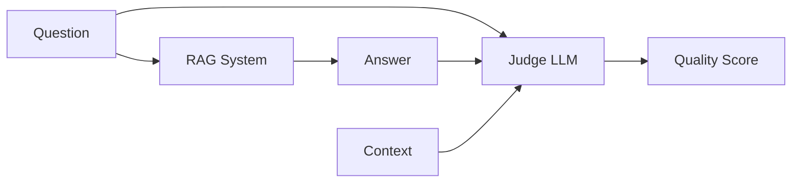

# 13 — Evaluating and Observing LLM Applications

> 📓 **Hands-on Notebook:** [13 — LLM Evaluation and Observability](../notebooks/13_LLM_Evaluation_and_Observability.ipynb)

**Level:** Expert | **Reading time:** 30-40 minutes

## Learning Objectives

- Understand why LLM evaluation differs from traditional ML
- Learn key evaluation metrics for RAG and generation
- Understand LLM-as-a-judge concepts
- Learn about observability and tracing
- Know how to build an evaluation dataset

---

## 1. Why LLM Evaluation Is Hard

| Traditional ML | LLM Applications |
|---------------|-----------------|
| Clear right/wrong | Multiple valid answers |
| Numerical metrics | Subjective quality |
| Deterministic | Probabilistic |
| Fixed output format | Variable output format |

## 2. Key Metrics

| Metric | What It Measures |
|--------|-----------------|
| **Answer correctness** | Is the answer factually correct? |
| **Relevance** | Does it address the question? |
| **Faithfulness** | Is it supported by the context? |
| **Groundedness** | Are claims traceable to sources? |
| **Context relevance** | Are retrieved docs relevant? |
| **Latency** | How fast is the response? |
| **Cost** | How many tokens/money? |

## 3. LLM-as-a-Judge

Using one LLM to evaluate another LLM's output:

**Limitations:**
- Judge models have their own biases
- May prefer longer or more fluent answers
- Not infallible for factual verification

## 4. Observability

**Observability** means understanding what happened inside your application.

| What to Trace | Why |
|--------------|-----|
| Input prompt | Debug what the LLM received |
| Model output | See what was generated |
| Latency | Identify slow components |
| Token usage | Monitor cost |
| Retrieved documents | Verify retrieval quality |

## 5. Building an Evaluation Dataset

Create questions with expected answers:
- Question: "What is cross-validation?"
- Expected topics: ["cross_validation"]
- Expected keywords: ["folds", "train", "test"]
- Difficulty: "easy"

## 6. Key Takeaways

- LLM evaluation requires different metrics than traditional ML
- Measure retrieval quality, answer quality, and operational metrics
- LLM-as-judge is powerful but has limitations
- Always build an evaluation dataset
- Observability enables debugging and monitoring

## 7. Further Reading

**Official Documentation:**
- [Evaluation (LangChain)](https://python.langchain.com/docs/concepts/evaluation/)
- [LangSmith](https://docs.smith.langchain.com/)

---

**Previous:** [12 — LangGraph](12_LangGraph_for_Data_Science.md)
**Next:** [14 — Security](14_LLM_Security_and_Prompt_Injection.md)

**Back to:** [Reading Index](README.md)
