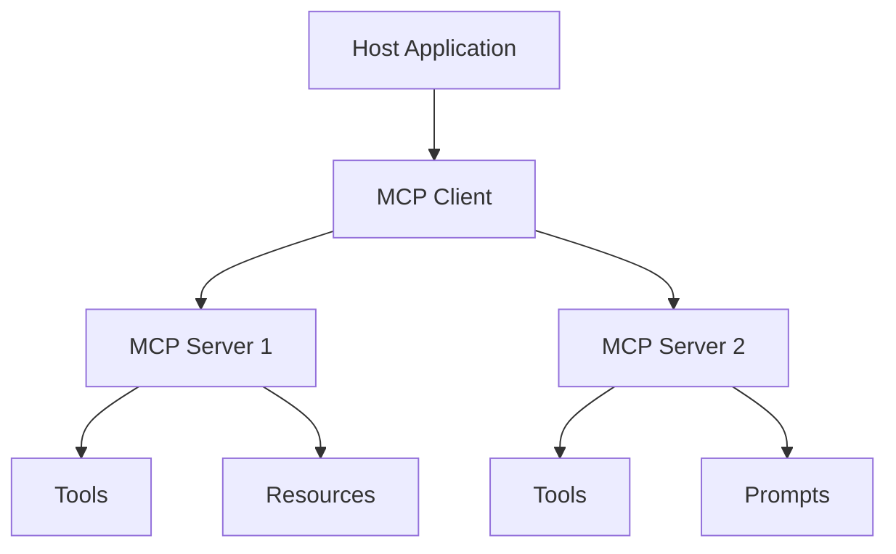

# 15 — Model Context Protocol (MCP) and Data Science

> 📓 **Hands-on Notebook:** [15 — MCP for Data Science](../notebooks/15_MCP_for_Data_Science.ipynb)

**Level:** Expert | **Reading time:** 30-40 minutes

## Learning Objectives

- Understand what MCP is and the problem it solves
- Learn about MCP tools, resources, and prompts
- Know the difference between LangChain tools and MCP tools
- Understand MCP security considerations
- Know when to use MCP vs direct tool integration

---

## 1. What is MCP?

**MCP** (Model Context Protocol) is an open standard for connecting AI applications to tools and data.

**The problem:** Before MCP, every AI app needed custom integrations. MCP provides a **standard interface** that works across all MCP-compatible clients.

## 2. MCP Concepts

| Concept | Description |
|---------|-------------|
| **MCP Server** | Exposes tools, resources, prompts |
| **MCP Client** | Connects to servers, invokes tools |
| **Tools** | Functions the LLM can call |
| **Resources** | Data the LLM can read |
| **Prompts** | Reusable prompt templates |

## 3. LangChain Tools vs MCP Tools

| Aspect | LangChain Tool | MCP Tool |
|--------|---------------|----------|
| **Transport** | In-process call | JSON-RPC over stdio/HTTP |
| **Interoperability** | LangChain only | Any MCP client |
| **Server model** | Tools in application | Tools on separate server |
| **Discovery** | Passed directly | Discovered at runtime |

## 4. When to Use MCP

**Use MCP when:**
- You want tools to work across multiple AI apps
- You need standardized tool interfaces
- You want to separate tool logic from application logic

**Use direct tools when:**
- Building a simple, single-purpose application
- Tools are tightly coupled to the application
- You don't need interoperability

## 5. Security Considerations

- Only connect to trusted MCP servers
- Validate all tool inputs and outputs
- Use authentication for HTTP servers
- Monitor tool calls for unusual patterns

## 6. Key Takeaways

- MCP standardizes how AI apps connect to tools and data
- FastMCP makes creating MCP servers simple in Python
- langchain-mcp-adapters bridges MCP tools to LangChain
- MCP servers are model-agnostic — same tools work with any LLM
- Always validate inputs and outputs for security

## 7. Further Reading

**Official Documentation:**
- [MCP Specification](https://modelcontextprotocol.io/)
- [langchain-mcp-adapters](https://github.com/langchain-ai/langchain-mcp-adapters)
- [FastMCP](https://gofastmcp.com/)

---

**Previous:** [14 — Security](14_LLM_Security_and_Prompt_Injection.md)
**Next:** [16 — Production Applications](16_Production_LLM_Applications.md)

**Back to:** [Reading Index](README.md)
