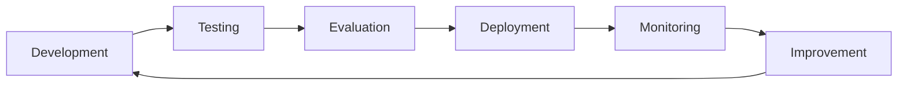

# 16 — From Prototype to Production: LLM Applications

> 📓 **Hands-on Notebook:** [16 — Production LLM Applications](../notebooks/16_Production_LLM_Applications.ipynb)

**Level:** Expert | **Reading time:** 35-45 minutes

## Learning Objectives

- Understand the gap between notebook prototypes and production apps
- Learn configuration management and secrets handling
- Understand error handling, retries, and rate limiting
- Learn caching, logging, and cost control
- Know deployment considerations for API vs Ollama

---

## 1. Notebook vs Production

| Aspect | Notebook | Production |
|--------|----------|-----------|
| **Error handling** | Try/except | Comprehensive recovery |
| **Configuration** | Hardcoded | Environment variables |
| **Secrets** | In code | Secret managers |
| **Logging** | print() | Structured logging |
| **Testing** | Manual | Automated |
| **Monitoring** | None | Metrics, alerts |

## 2. Production Lifecycle

## 3. Configuration Management

**Never hardcode configuration.** Use:
- Environment variables
- Configuration dataclasses
- .env files (local development)
- Secret managers (production)

## 4. Error Handling

| Error Type | Recovery |
|-----------|----------|
| **Rate limit** | Exponential backoff |
| **Timeout** | Retry with longer timeout |
| **API error** | Retry, then fallback |
| **Validation error** | Return error message |

## 5. Caching

Cache identical requests to reduce cost and latency:
- **Exact match:** Hash of input
- **TTL cache:** Time-based expiry
- **Semantic cache:** Embedding similarity

## 6. Cost Control

Track and limit costs:
- Monitor token usage
- Set daily budgets
- Use cheaper models for simple tasks
- Cache to reduce redundant calls

## 7. Model Selection

| Model | Best For | Cost |
|-------|----------|------|
| **gpt-4o-mini** | Simple tasks | Low |
| **gpt-4o** | Complex reasoning | Medium |
| **Llama 3.2** | Privacy-sensitive | Free |

## 8. Deployment Options

| Option | Complexity | Cost | Best For |
|--------|-----------|------|----------|
| **Jupyter** | Low | Free | Development |
| **Flask/FastAPI** | Medium | Low | Small apps |
| **Docker** | Medium | Low-Med | Consistent deploys |
| **Cloud (AWS/GCP)** | High | Medium-High | Scale |

## 9. Key Takeaways

- Production requires much more than notebook code
- Always use environment variables for configuration
- Implement retries, rate limiting, and caching
- Track costs and set budgets
- Test thoroughly before deploying

## 10. Further Reading

**Official Documentation:**
- [LangServe](https://python.langchain.com/docs/langserve/)
- [LangGraph Platform](https://langchain-ai.github.io/langgraph/)

---

**Previous:** [15 — MCP](15_MCP_for_Data_Science.md)
**Next:** [17 — Final Capstone](17_Final_Data_Science_Copilot.md)

**Back to:** [Reading Index](README.md)
