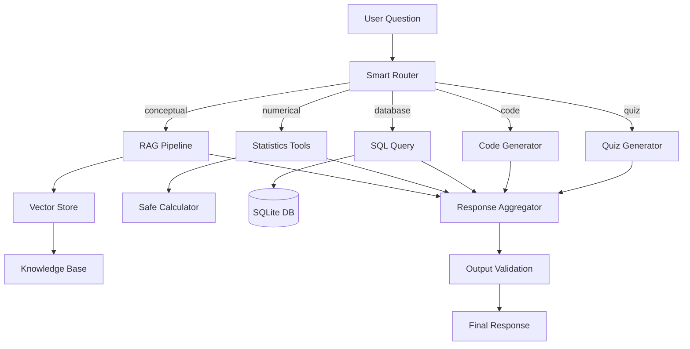

# 17 — Final Capstone: Data Science AI Copilot

> 📓 **Hands-on Notebook:** [17 — Final Data Science Copilot](../notebooks/17_Final_Data_Science_Copilot.ipynb)

**Level:** Expert | **Reading time:** 30-40 minutes

## Learning Objectives

- Understand how to combine all LangChain concepts into a complete application
- Learn the architecture of a production-ready AI copilot
- Understand the integration of RAG, tools, SQL, and routing
- Know how to evaluate and secure a complete application

---

## 1. What This Capstone Builds

A **Data Science AI Copilot** that combines every concept from the repository:

## 2. Architecture Components

| Component | Technology | Notebook Source |
|-----------|-----------|-----------------|
| **LLM** | GPT-4o-mini / Llama 3.2 | 01, 02 |
| **Prompts** | ChatPromptTemplate | 02 |
| **Chains** | LCEL pipe operator | 03 |
| **Embeddings** | OpenAI / Ollama | 04 |
| **Vector Store** | ChromaDB | 04, 05 |
| **RAG** | Retrieval-augmented generation | 05, 08 |
| **Tools** | @tool decorator | 06 |
| **SQL** | SQLite with safe execution | 10 |
| **Router** | Keyword-based classification | 12 |
| **Security** | Input/output validation | 14 |
| **Production** | Caching, logging, error handling | 16 |

## 3. Design Principles

| Principle | Implementation |
|-----------|---------------|
| **Separation of concerns** | Each component has one job |
| **Provider-agnostic** | Config toggle for API/Ollama |
| **Fail-safe** | Graceful degradation at every layer |
| **Observable** | Logging and metrics |
| **Secure** | Input/output validation |

## 4. Smart Router

The router classifies questions and routes them to the appropriate handler:
- **Conceptual:** → RAG pipeline
- **Numerical:** → Statistics tools
- **Database:** → SQL query
- **Code:** → Code generator
- **Quiz:** → Quiz generator

## 5. Evaluation Framework

The capstone includes:
- Route accuracy testing
- Keyword coverage measurement
- Latency tracking
- Cache hit rate monitoring

## 6. Security

| Protection | Implementation |
|------------|----------------|
| **Input validation** | Length, empty, injection checks |
| **SQL safety** | SELECT-only, no dangerous commands |
| **Tool safety** | No arbitrary code execution |
| **Output validation** | Data leakage detection |

## 7. Student Project

Build your own domain-specific AI copilot:
1. Choose a domain (healthcare, finance, agriculture, etc.)
2. Create a knowledge base (10+ documents)
3. Build tools (2+ minimum)
4. Implement routing (3+ routes)
5. Add evaluation (5+ test cases)
6. Apply security (input/output validation)

## 8. Key Takeaways

- A complete LLM application combines many components
- Architecture matters — clean separation, error handling, security
- Router-based design enables flexible question handling
- Evaluation is essential for quality assurance
- Security must be built in from the start, not added later

## 9. Further Reading

**Official Documentation:**
- [LangChain Tutorials](https://python.langchain.com/docs/tutorials/)
- [LangGraph](https://langchain-ai.github.io/langgraph/)

---

**Previous:** [16 — Production Applications](16_Production_LLM_Applications.md)

**Back to:** [Reading Index](README.md) | [Repository README](../README.md)
